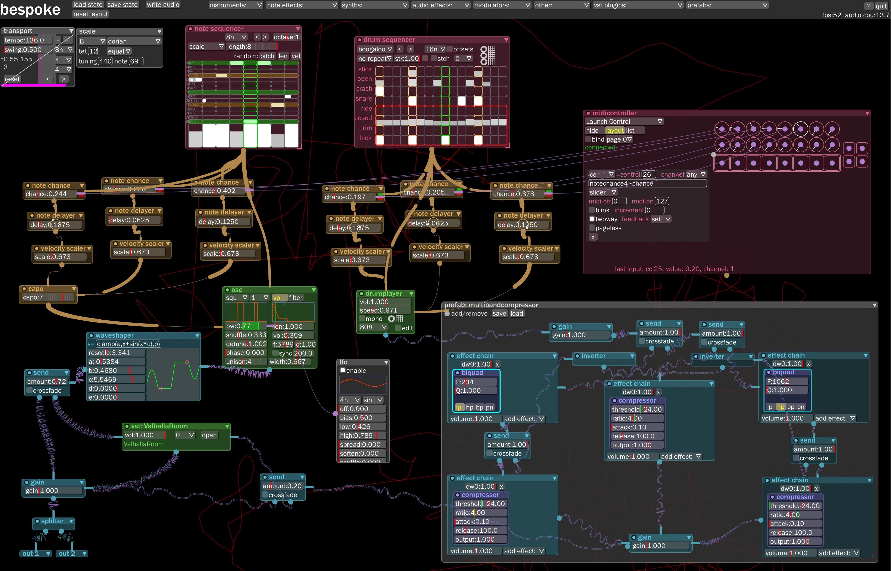
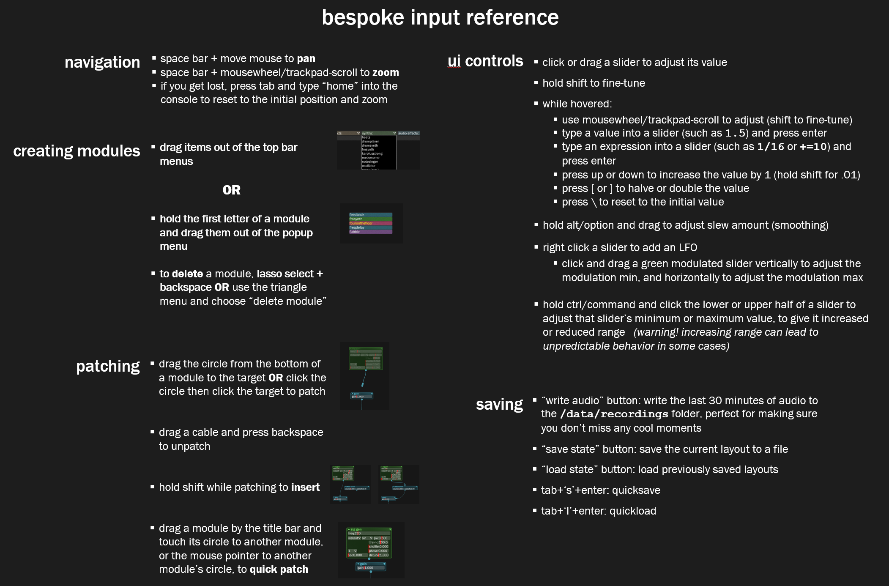

[](https://dev.azure.com/awwbees/BespokeSynth/_build/latest?definitionId=1&branchName=main)
[](code_of_conduct.md)


# Bespoke Synth

A software modular synth that I've been building for myself since 2011, and now you can use it!

[Nightly Build](https://github.com/BespokeSynth/BespokeSynth/releases/tag/Nightly) (updated every commit)

You can find the most recent builds for Mac/Windows/Linux at http://bespokesynth.com, or in the [Releases](https://github.com/BespokeSynth/BespokeSynth/releases) section on GitHub.

Join the [Bespoke Discord](https://discord.gg/YdTMkvvpZZ) for support and to discuss with the community.


## Documentation

* [Official documentation](https://www.bespokesynth.com/docs/)
* [Searchable, community-written documentation](https://github.com/BespokeSynth/BespokeSynthDocs/wiki)


## Screenshot




## Basic Overview/Tutorial Video

[](https://www.youtube.com/watch?v=SYBc8X2IxqM)
* https://youtu.be/SYBc8X2IxqM

### Quick Reference




### Features

* live-patchable environment, so you can build while the music is playing
* VST, VST3, LV2 hosting
* Python livecoding
* MIDI & OSC controller mapping
* Works on Windows, Mac, and Linux


### License

[GNU GPL v3](LICENSE)


### Releases

Sign up here to receive an email whenever I put out a new release: http://bespokesynth.substack.com/


### Contributing

[See our contributing guidelines](CONTRIBUTING.md)


### Building

Building Bespoke from source is easy and fun! The basic cmake prescription gives you a completed
executable which is ready to run on your system in many cases. If your system does not have `cmake` installed already you must do so.

```shell
git clone https://github.com/BespokeSynth/BespokeSynth   # replace this with your fork if you forked
cd BespokeSynth
git submodule update --init --recursive
cmake -Bignore/build -DCMAKE_BUILD_TYPE=Release
cmake --build ignore/build --parallel 4 --config Release
```

This will produce a release build in `ignore/build/Source/BespokeSynth_artefacts`.

There are a few useful options to the *first* cmake command which many folks choose to use.

* `-DBESPOKE_VST2_SDK_LOCATION=/path/to/sdk` will activate VST2 hosting support in your built
  copy of Bespoke if you have access to the VST SDK
* `-DBESPOKE_ASIO_SDK_LOCATION=/path/to/sdk` (windows only) will activate ASIO support on windows in your built copy of Bespoke if you have access to the ASIO SDK
* `-DBESPOKE_SPACEMOUSE_SDK_LOCATION=/path/to/sdk` (windows only) will activate SpaceMouse canvas navigation support on windows in your built copy of Bespoke if you have access to the SpaceMouse SDK
* `-DBESPOKE_PYTHON_ROOT=/...` will override the automatically detected python root. In some cases with M1 mac builds in homebrew this is useful.
* `-DCMAKE_BUILD_TYPE=Debug` will produce a build with debug information available
* `-A x64` (windows only) will force visual studio to build for 64 bit architectures, in the event this is not your default
* `-GXcode` (mac only) will eject xcode project files rather than the default make files
* `-DCMAKE_INSTALL_PREFIX=/usr` (only used on Linux) will set the `CMAKE_INSTALL_PREFIX` which guides both where your
  built bespoke looks for resources and also where it installs. After a build on Linux with this configured, you can
  do `sudo cmake --install ignore/build` and bespoke will install correctly into this directory. The cmake default is `/usr/local`.

The directory name `ignore/build` is arbitrary. Bespoke is set up to `.gitignore` everything in the `ignore` directory but you
can use any directory name you want for a build or have multiple builds also.

To be able to build you will need a few things, depending on your OS

* All systems require an install of git
* On Windows:
    * Install Visual Studio 2019 Community Edition. When you install Visual Studio, make sure to include CLI tools and CMake, which are included in
      'Optional CLI support' and 'Toolset for Desktop' install bundles
    * Python from python.org
    * Run all commands from the visual studio command shell which will be available after you install VS.
* On MacOS: install xcode; install xcode command line tools with `xcode-select --install` and install cmake with `brew install cmake` if you use homebrew or from cmake.org if not
* On Linux you probably already have everything (gcc, git, etc...), but you will need to install required packages. The full list we
  install on a fresh ubuntu 20 box are listed in the azure-pipelines.yml
    * Some distributions may have slightly different package names like for instance Debian bookworm: You need to replace `alsa` and `alsa-tools` with `alsa-utils`
