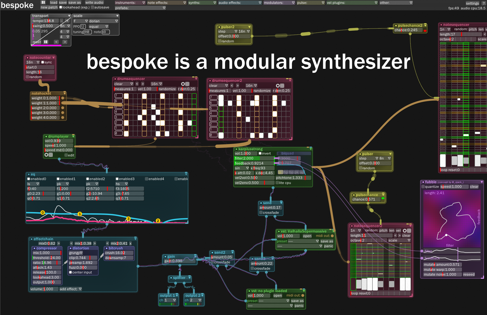

# Bespoke Synth
A software modular synth that I've been building for myself since 2011, and now you can use it!

You can find the most recent builds for Mac/Windows/Linux at http://bespokesynth.com, or in the [Releases](https://github.com/awwbees/BespokeSynth/releases) section on GitHub.

Join the [Bespoke Discord](https://discord.gg/YdTMkvvpZZ) for support and to discuss with the community.

<a href='https://ko-fi.com/awwbees' target='_blank'>

## Screenshot

## Basic Overview/Tutorial Video

* https://youtu.be/SYBc8X2IxqM

### Quick Reference

### Features
* live-patchable environment, so you can build while the music is playing
* VST hosting
* Python livecoding
* MIDI controller mapping
* Works on Windows, Mac, and Linux

### Releases
Sign up here to receive an email whenever I put out a new release: http://bespokesynth.substack.com/

### Building
Use the "Projucer" from https://juce.com/ to generate solutions/project files/makefiles for building on your platform.
